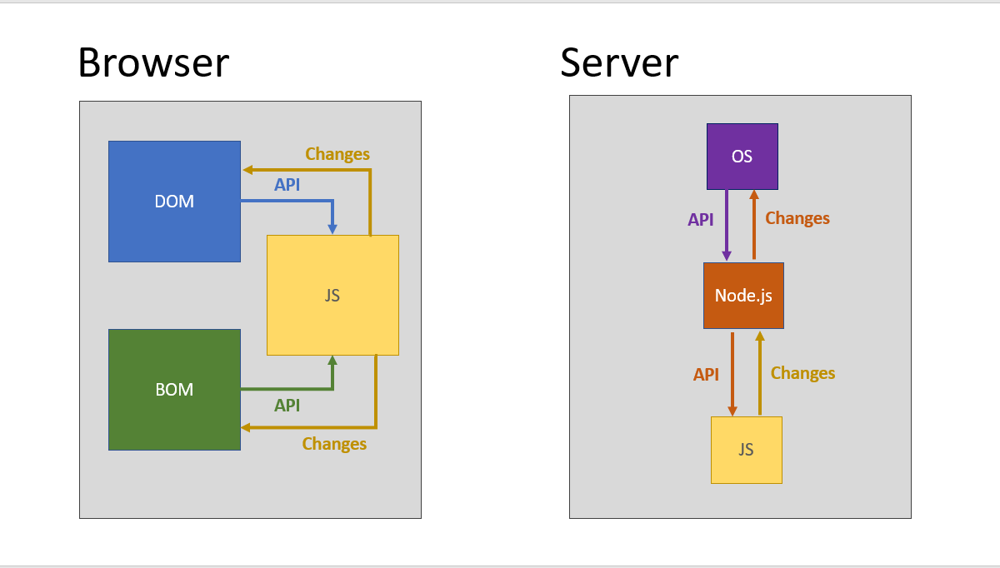

## Теория: Роль JS



JS - это прослойка, которая имеет **доступ к API среды** 
и может **манипулировать его данными** _(создать, удалить, изменить)_. 

### Browser 

**DOM** - всё, что относится к дереву элементов страницы

**BOM** - всё, что относится к API броузера

### Server

**Node.js** - платформа для запуска наших скриптов, 
которая предоставляет своё API для досутпа к OS.

## Практика

#### JS:
- [ ] Что такое объект? Зачем нужна такая структура данных?
  ```javascript
  const person = {
    name: 'Vasya Sidorov',
    age: 20
  }
  
  const mobilePhone = {
    brand: 'Apple',
    model: 'XR',
    space: '256GB',
    ram: '8GB',
    battery: '50A',
    exploreInternet: () => {
      // visit website
    },
    call: () => {
      // send phonecall
    },
    sendSMS: () => {
      // ... send SMS
    }
  }
  ```
- [ ] Как объявить переменную? (<s>var</s>, let, const)
  ```javascript
  // показываем, что мы можем переопределить переменную,
  // используя оператор присваивание (=)
  let age = 20;
  age = 21; // Работает!  
  age = 22;
  
  // переопределять не будем!
  const name = 'Vasya';
  name = 'Petya' // ОШИБКА!
  
  // само содержимое изменить можно
  const person = { name: 'Olya' };
  person.name = 'Sveta' // Работает!
  ```
- [ ] Как объявить функцию? (обычная и стрелочная запись)
  ```javascript
  function doSomething() {
    // ...function body
  }
  
  const doSomething2 = function() {
    // ...function body
  }
  
  const doSomething3 = () => {
    // ...function body
  };
  ```
#### DOM:

- [ ] Что такое DOM-элемент?

- [ ] Как найти DOM-элемент(ы)? 

  ```javascript
  // можно искать с корня страницы
  document.querySelector('%YOUR_SELECTOR%');
  document.querySelectorAll('%YOUR_SELECTOR%');
  
  // можно искать с какого-то определенного узла
  // <div class="parent">
  //   <div class="child">Find Me</div>
  // </div>
  const parentEl = document.querySelector('.parent');
  const childEl = parentEl.querySelector('.child');
  ```
  
- [ ] Что такое "событие" и как его обработать?

  _Посмотреть  про все события_ [здесь](https://developer.mozilla.org/ru/docs/Web/Events
  )
    ```javascript
    myElement.addEventListener('click', () => {
      // ... мой обработчик
    });
    ```
  
- [ ] Как получить "значение" input-элемента? Как его изменить?
    ```javascript
    // -> получить 
    myElement.value
  
    // <- изменить 
    myElement.value = %MY_VALUE%;
    ```
- [ ] Как создать элемент(ы)?
  ```javascript
  const newEl = document.createElement('%ELEMENT_NAME%');
  parentEl.append(newEl);
  
  // or
  
  parentEl.innerHTML = '<div>... other html</div>'
  ```
- [ ] Как задать декстовое содержимое для DOM-уэлемента?
  ```javascript
  myElement.textContent = '%YOUR_STRING%'
  ```
- [ ] Как задать или удалить css-класс?
  ```javascript
  // добавить
  myElement.classList.add('%YOUR_CLASSNAME%');
  
  // удалить
  myElement.classList.remove('%YOUR_CLASSNAME%');
  
  // "переключить" 
  // - если класса нет, то -- добавить; 
  // - если класс есть, то -- убрать
  myElement.classList.toggle('%YOUR_CLASSNAME%');
  ```
- [ ] Как удалить DOM-элемент?
  ```javascript
  myElement.remove()
  ```  
